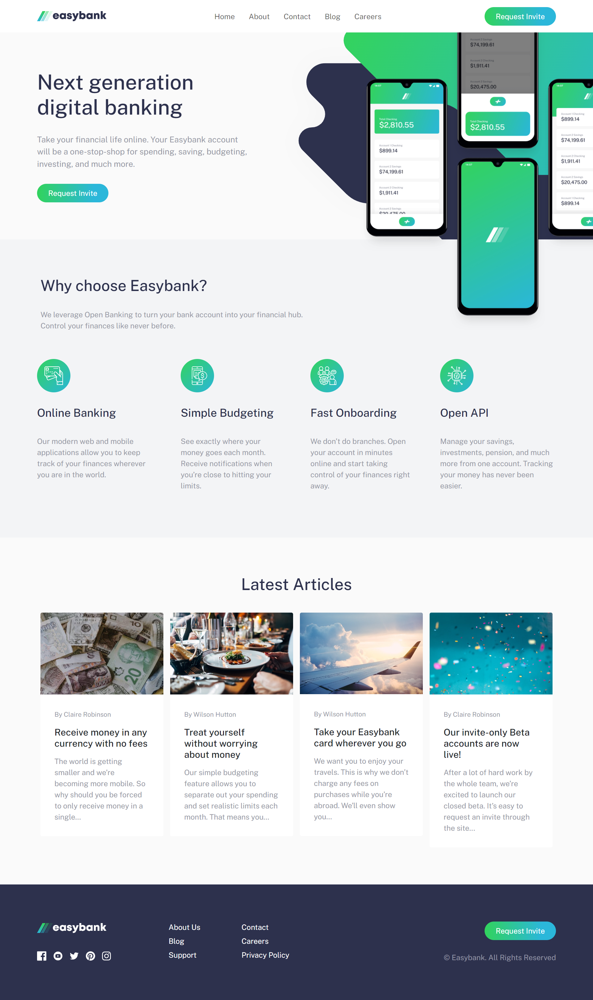

# Frontend Mentor - Easybank landing page solution

This is my solution to the [Easybank landing page challenge on Frontend Mentor](https://www.frontendmentor.io/challenges/easybank-landing-page-WaUhkoDN). Frontend Mentor challenges help you improve your coding skills by building realistic projects.

**NOTE: I did not have access to the Figma/Sketch file, so the design is far from being pixel perfect.**

## Table of contents

- [The challenge](#the-challenge)
- [Screenshots](#screenshots)
- [Links](#links)
- [Built with](#built-with)
- [Author](#author)

## The challenge

Users should be able to:

- View the optimal layout for the site depending on their device's screen size
- See hover states for all interactive elements on the page

## Screenshots

### Desktop View

### Mobile View

## Links

- Live Site URL: [Solution Hosted using Vercel](https://easybank-landing-page-eight-psi.vercel.app/)

## Built with

- Semantic HTML5 markup
- CSS Custom Properties
- Bootstrap v5.3+
- JavaScript
- DOM Manipulation
- Event Handling
- Mobile-first workflow

## Author

- Frontend Mentor - [@Marvin-Figueroa](https://www.frontendmentor.io/profile/Marvin-Figueroa)
